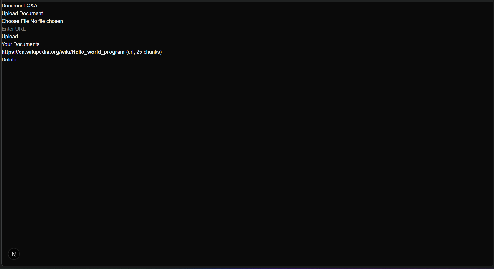
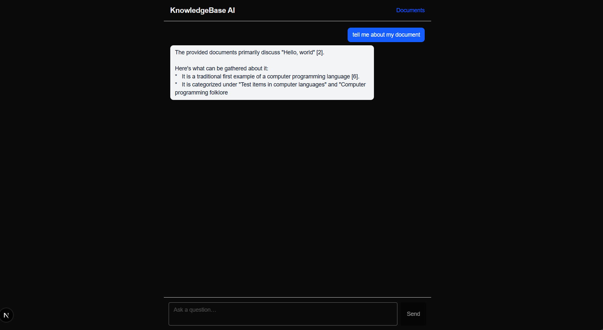

# KnowledgeBase AI

A personal document Q&A system. Ingest PDFs, Markdown/text, and web pages into a vector store, then chat with them — answers stream token-by-token with inline citations back to the source passages.




---

## How it works

Three deployables: a Next.js frontend (Vercel), a FastAPI backend (Railway), and a Postgres instance with `pgvector` (Railway). The frontend talks to the backend over REST for ingestion/documents and Server-Sent Events for streaming chat. The Gemini API key never leaves the backend.

```
Next.js (Vercel) ──HTTPS──▶ FastAPI (Railway) ──SQL──▶ Postgres + pgvector
                            │
                            └──HTTPS──▶ Gemini API (embeddings + generation)
```

The RAG pipeline is built on **LangChain** — each backend module under `backend/app/rag/` is a thin wrapper around framework primitives:

- **Loaders** — `PyPDFLoader` for PDFs, `WebBaseLoader` for URLs, `TextLoader` for `.md`/`.txt`. Markdown also gets `MarkdownHeaderTextSplitter` so each chunk carries a `heading_path`.
- **Splitting + embedding** — `RecursiveCharacterTextSplitter` (~1000 chars / 150 overlap), then `GoogleGenerativeAIEmbeddings` (`text-embedding-004`, 768-dim).
- **Vector store** — LangChain's `PGVector` over `pgvector`. A small `documents_registry` table (managed by us via Alembic) tracks ingested sources for listing/deletion; chunks are removed via PGVector's metadata filter on `document_id`.
- **Hybrid retrieval** — `EnsembleRetriever` combines a `PGVector` semantic retriever and an in-memory `BM25Retriever` using Reciprocal Rank Fusion (50/50 weighting).
- **Chat chain** — `create_history_aware_retriever` rewrites follow-up questions into standalone queries, `create_stuff_documents_chain` stuffs numbered passages into the prompt, and `create_retrieval_chain` ties them together.
- **Multi-turn** — `RunnableWithMessageHistory` + `PostgresChatMessageHistory` persists turns to a `message_store` table, keyed by session id.
- **Streaming + citations** — the backend consumes `chain.astream_events(..., version="v2")` and forwards token deltas to the browser as SSE. A small regex extractor parses `[n]` markers in the final answer and emits a separate `citations` event that maps each marker to its source chunk.


---

## Tech stack

- **Backend:** Python 3.12, FastAPI, LangChain (`langchain`, `langchain-core`, `langchain-google-genai`, `langchain-postgres`, `langchain-community`), SQLAlchemy + Alembic, `psycopg`, `pypdf`, `rank_bm25`.
- **Frontend:** Next.js 16 (App Router), React 19, TypeScript, Tailwind v4, Playwright for e2e.
- **Database:** Postgres 16 with the `pgvector` extension.
- **LLM:** Gemini `gemini-2.0-flash` via `langchain-google-genai`.
- **Embeddings:** Gemini `text-embedding-004` (768 dimensions).
- **Hosting:** Vercel (frontend), Railway (backend + Postgres).

---

## Local development

Requirements: Docker, Python 3.12+, Node 20+, a Gemini API key (free tier is fine).

### 1. Start Postgres + pgvector

```bash
make db-up
```

This brings up `pgvector/pgvector:pg16` from [docker-compose.yml](docker-compose.yml) on `localhost:5432` (user/password/db all `kb`).

### 2. Configure backend env

Create `backend/.env`:

```env
DATABASE_URL=postgresql+asyncpg://kb:kb@localhost:5432/kb
SYNC_DATABASE_URL=postgresql+psycopg://kb:kb@localhost:5432/kb
GOOGLE_API_KEY=your-gemini-api-key
APP_TOKEN=any-shared-secret-for-the-frontend
ALLOWED_ORIGINS=http://localhost:3000
PG_COLLECTION_NAME=kb_chunks
```

### 3. Install + migrate + run the backend

```bash
cd backend
pip install -e ".[dev]"
alembic upgrade head
uvicorn app.main:app --reload
```

The API is now on `http://localhost:8000`. LangChain's `PGVector` and `PostgresChatMessageHistory` tables are created lazily on first use; the Alembic migration only manages `documents_registry`.

### 4. Configure + run the frontend

Create `frontend/.env.local`:

```env
NEXT_PUBLIC_API_BASE_URL=http://localhost:8000
NEXT_PUBLIC_APP_TOKEN=any-shared-secret-for-the-frontend
```

Then:

```bash
cd frontend
npm install
npm run dev
```

Open `http://localhost:3000`, upload a document on the Documents page, and ask questions on the chat page.

### Tests

```bash
# backend
cd backend && pytest

# frontend e2e (requires backend + frontend running)
cd frontend && npx playwright test
```

---

## Things I'd build next

These are the natural next steps:

- **Multi-user auth** — replace the shared `APP_TOKEN` with real sessions; move the token out of the client bundle.
- **Re-ranking** — drop a cross-encoder reranker in front of the LLM via `ContextualCompressionRetriever`; should noticeably improve answer grounding.
- **Conversation tooling** — export, message edit, regenerate.
- **Document update workflow** — today the only path is delete + re-upload.
- **Watched-folder bulk ingest** — point the backend at a folder/Drive and have it pick up new files.
- **PDF image + table extraction** — currently only the text layer is indexed.
- **Observability** — Langfuse or OpenTelemetry for traces of retrieval/generation; today it's just structured logs.
- **Persistent BM25** — move the in-memory `BM25Retriever` to Postgres FTS via a custom retriever so it survives restarts and scales past in-memory rebuilds.
